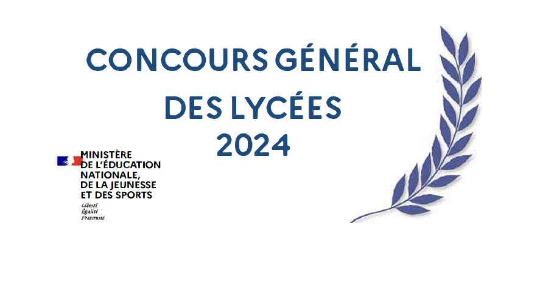
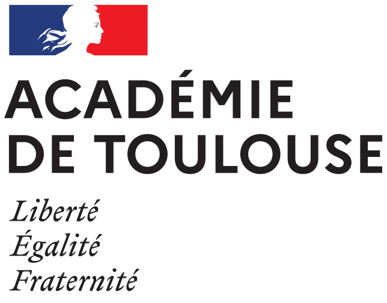
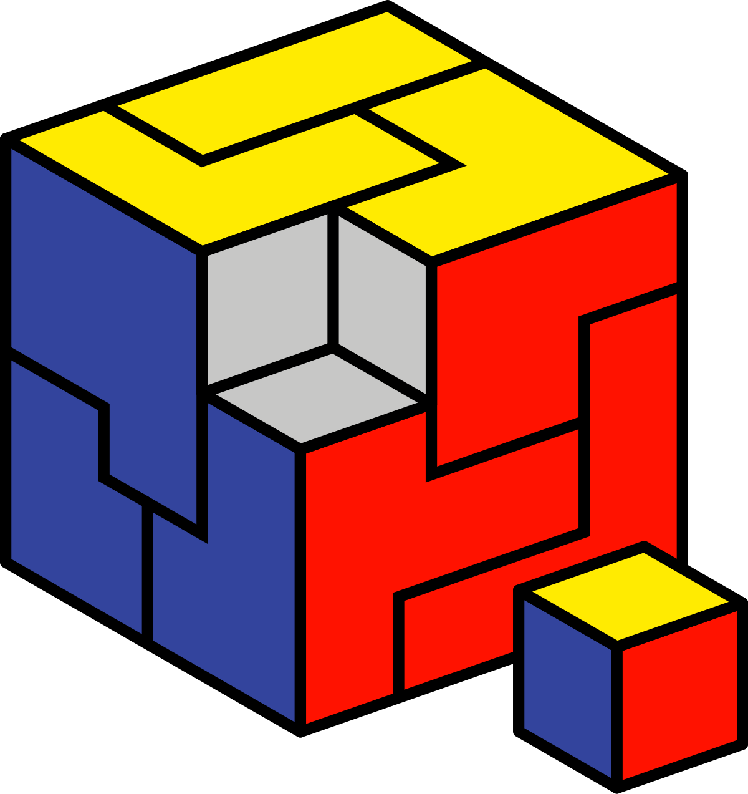
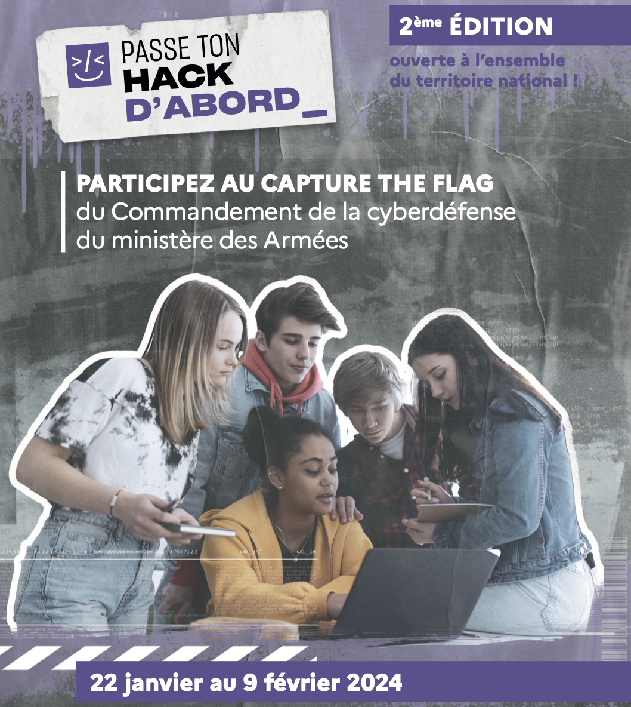
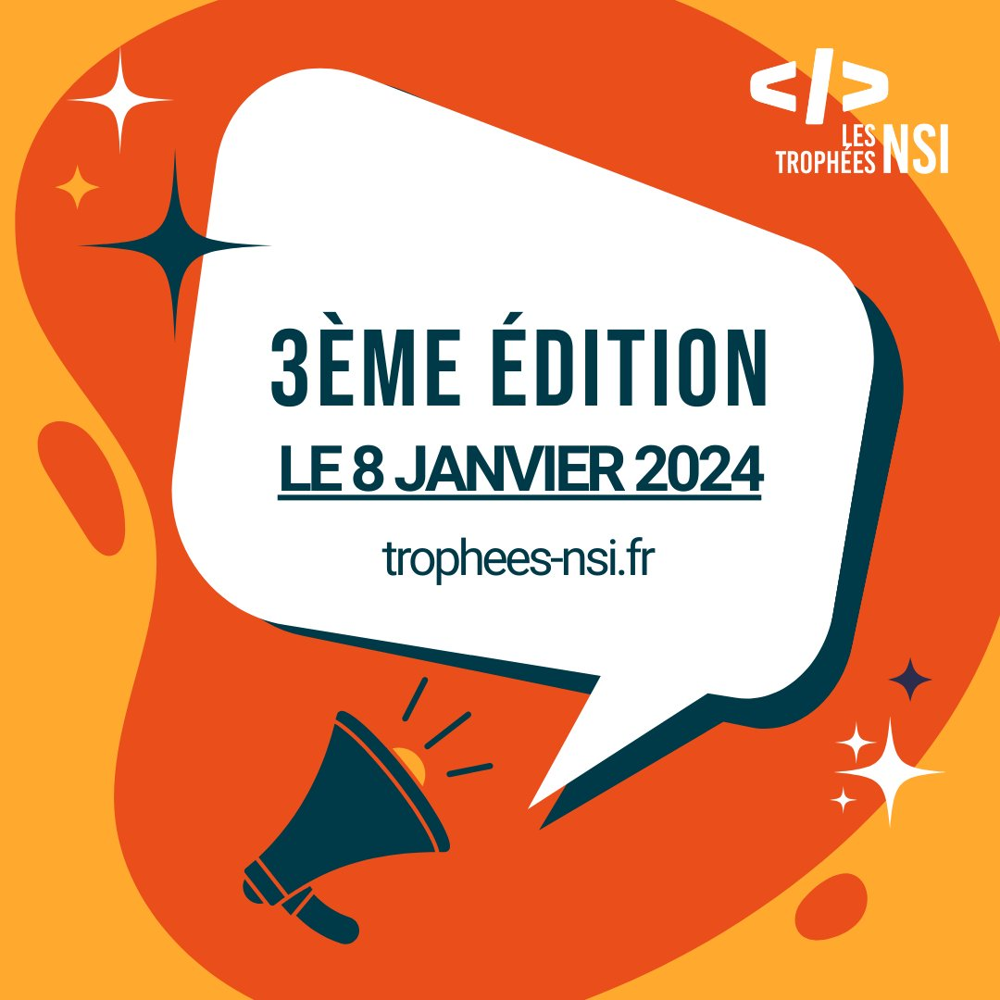

# Concours informatique 2024

|Nom|Public|Fin d'inscription|Par équipe|Dates du concours|
|:---:|:---:|:---:|:---:|:---:|
|CGL NSI|TNSI|15/12/23|Non|12/03/24 - 26/03/24|
|Olympiades NSI|PNSI|06/03/24|Non|24/04/24|
|Prologin|Tous|14/01/24|Non|28/01/24 - 25/02/24|
|Passe ton Hack|Tous|07/01/24|Oui|22/01/24 - 09/02/24|
|Trophées NSI|NSI|?|Oui|08/01/2024|

**📝 Pour s'inscrire à un concours : [Formulaire concours informatique 2024](https://forms.gle/qKmsdw9SC4Xsk9au9)**

## Concours Général des Lycées - NSI

Le concours général des lycées a pour objectif de distinguer les meilleurs élèves des classes de première et terminale préparant un baccalauréat général ou technologique.

### Organisation
▶︎ [Eduscol organisation du concours](https://eduscol.education.fr/1460/organisation-du-concours-general-des-lycees?menu_id=1745)

Le concours aura lieu entre le 12/03/24 et le 26/03/24. Il se tiendra dans un lycée de l'académie dont le lieu n'est pas encore connu. En NSI une seule épreuve écrite.

**‼️ Ce sont les enseignants qui doivent inscrire les élèves intéressés avant le 15/12/23.**

## Olympiades académiques NSI

Cette action s'inscrit pleinement dans le cadre de la politique de développement de la culture scientifique engagée par le Ministère de l'Éducation Nationale, de la Jeunesse et des Sports. Elle a pour ambition de développer le sens de l'initiative, le goût de la recherche, le lien entre le numérique et les autres sciences.

### Organisation

▶︎ [Académie de Toulouse : Olympiades de NSI](https://pedagogie.ac-toulouse.fr/informatique/olympiades-de-nsi)

Le concours aura lieu le 24/04/24 dans la matinée, dans un lycée de l'académie. Sous forme d'une épreuve écrite individuelle de 3H.

**‼️ Ce sont les enseignants qui doivent inscrire les élèves intéressés avant le 06/03/24.**

## Prologin

Prologin est un concours d'informatique ouvert à tous les étudiants âgés de moins de 21 ans, organisé par l'association Prologin. Notre but est de faire découvrir le monde de la programmation et de l'algorithmique aux étudiants et de les confronter à des problèmes classiques et des challenges excitants. Le concours se déroule en trois étapes de sélections consécutives présentées dans les sections suivantes. Prologin est une association à but non lucratif, et son concours est totalement gratuit.

### Organisation
- Épreuves qualificatives en ligne du **21/10/23 au 14/01/24**
- Épreuves régionales (si sélectionné) : 28/01/24 au 25/02/24
- Finale nationale (si sélectionné régional) : du 08/05/24 au 12/05/24

▶︎ Inscriptions en ligne : [Prologin 2024](https://prologin.org/)

## Passe ton Hack d'abord

Co-organisé par le Commandement de la cyberdéfense (COMCYBER) et la Direction générale de l'enseignement scolaire (DGESCO) du ministère de l’Éducation nationale et de la jeunesse, le capture the flag « Passe ton Hack d’abord » initie les lycéens à la cybersécurité en complément des programmes scolaires, et stimule leur intérêt pour ce domaine.

### Un capture the flag ?

Un capture the flag (CTF) est un jeu composé d’une série de défis techniques liés à l’informatique et aux réseaux. De difficulté variable, il aboutit, en cas de réussite, à la découverte d’un « Flag », une chaine de caractères secrète validant l’obtention de points. Ici, le thème est la sécurité informatique : le participant aura à résoudre 15 épreuves accessibles en ligne portant sur les sujets de programmation, de réseau, sténographie et cryptographie.

A la fin du challenge, les meilleurs repartiront avec un abonnement à la plateforme SEELA (Une plateforme web dédiée aux challenges d'expert en sécurité offensive et défensive), remis lors d’un évènement au Campus cyber.

### Un challenge pour qui ?

Le projet s’adresse à un public jeune du niveau seconde à BAC+2 qui, pour certains, débutent en informatique. Les épreuves ont été **spécifiquement étudiées pour être résolues par un public lycéen**, certaines ont cependant un niveau de difficulté plus élevé afin de départager les élèves.

L'édition 2023 est une année d'expérimentation limitée aux académies de Créteil, Paris et Versailles avant une possible généralisation pour l'année scolaire 2023-2024.

Si tous les élèves de ces établissements peuvent participer, l’évènement s’adresse particulièrement aux **classes de seconde, première, terminale et aux personnes préparant un BTS en lien avec les métiers du numériques, du cyber, ou les sciences de l’ingénieur**. Attention, les équipes doivent être constituées de **2 à 6 élèves, et doivent inclure au moins 2 candidates**.

**Inscription des équipes par les enseignants avant le 07/01/24**

▶︎ [Académie de Paris : Présentation du concours](https://www.ac-paris.fr/passe-ton-hack-d-abord-128309)

## Trophées NSI

Les Trophées NSI récompensent des projets informatiques, réalisés par les lycéennes et les lycéens de première et de terminale, pendant les heures consacrées à l’enseignement de la spécialité « numérique et sciences informatiques ».

Ce concours s’adresse aux lycées publics d’enseignement général, aux lycées d'enseignement privé sous contrat avec le Ministère de l’Éducation nationale et aux lycées français à l’étranger rattachés au réseau de l’AEFE.

### Comment se déroule le concours ?

- Une organisation par territoire avec une finale nationale.
- Les meilleurs projets de première et de terminale sont sélectionnés pour la finale nationale.
- Toutes les équipes concourent pour les mêmes prix. 3 catégories de prix déclinées en sous-catégorie : Première ou Terminale.
- 2 à 6 prix potentiels par territoire, selon le volume de projets et la qualité des dossiers.
- Seuls 6 prix seront remis lors de la finale nationale.
- Des lots prévus pour les lauréats nationaux (livre sur l'informatique, bons cadeaux, entrées pour des séances en Virtual Room, Raspberry Pi, etc).

33 territoires seront représentés pour la nouvelle édition 2024 !

> 30 territoires académiques (25 académies métropolitaines et 5 académies d'Outre-mer : Guadeloupe, Guyane, Martinique, Mayotte, Réunion).
> 1 territoire regroupant les collectivités d’outre-mer (Wallis et Futuna, Polynésie française, Nouvelle Calédonie).
> 2 territoires pour les lycées français à l’étranger rattachés au réseau de l’AEFE : la zone Amérique / Europe / Afrique et la zone Zone Océan Indien / Proche et Moyen Orient / Asie.

**Les Trophées NSI 2024 seront lancés le 8 janvier 2024**

▶︎ [Site web des Trophées NSI](https://trophees-nsi.fr/)